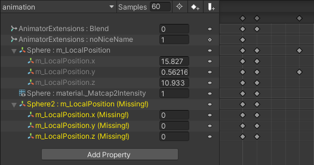

# 🌸 Animator Extensions

Forked from https://github.com/lukis101/VRCUnityStuffs/tree/master/Scripts/Editor

⚠ This is experimental! It's doing a lot, so it might break things. Hopefully not, but please let me know if it does 💕

Some [Harmony](https://github.com/pardeike/Harmony)-based patches to Unity's Animator window. This tool packages a re-namespaced version of Harmony to avoid causing issues if you already have a Harmony dll in the project.  

## Usage: 

Clone Repo, add `Razgriz` folder to Assets folder of project. Configure at `Tools -> AnimatorExtensions`.

Settings are saved in EditorPrefs, so they persist across any projects that have AnimatorExtensions installed.

## Images

## Changes

### New Options

- Change default state Write Defaults setting
- Change default Layer Weight to 1
- Change default Transition Exit/Transition time to 0
- Show extra labels on animation states (Animation clip/BlendTree name)
  - `B` if has StateBehaviors
  - `WD` if has Write-Defaults enabled
- Show actual property name instead of "Display Name" in animation window

### Tweaks/Fixes

- Layer copy-pasting and duplication (including cross-controller) via context menu or keyboard shortcuts
- F2 keyboard shortcut to rename selected layer
- Instead of the annoying list scrollbar reset, get new or edited layer in view
- Similarly scroll to bottom when adding a new parameter
- Prevent transition condition mode/function resetting when swapping parameter
- Highlight/select animator controller by single/double-clicking its path in bottom bar
- Disable undo of "Paste Sub-Sate Machine" action as it leaves dangling sub-assets.  
  - Manually delete pasted layers or sub-state machines to correctly dispose of majority _(but still not all)_ of sub-assets!

## Known Issues

- `Unsupported.PasteToStateMachineFromPasteboard` copies some parameters, but does not copy their default values
  - It also does not have proper undo handling causing dangling sub-assets left in the controller
- State node motion label overlaps progress bar in "Live Link" mode
- Animation Window "Show Actual Names"

## TODO

- Option to rename property names
- Recolor States
- Project Window: show multiple columns of data about assets? asset type, filetype
- Drag to 

Maybe:

- Implement needle tools drag-to-retarget on Animation paths
- Add undo callback handler to delete sub-state machines properly
- Clean up layer copy/paste (don't take up clipboard)
