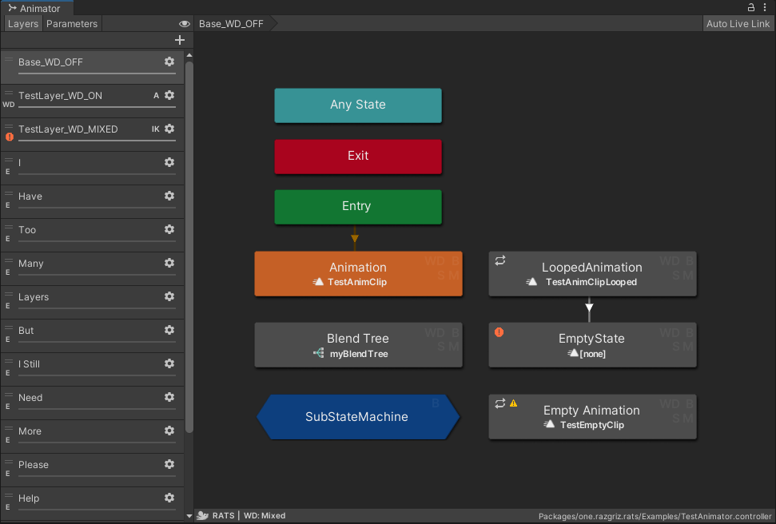
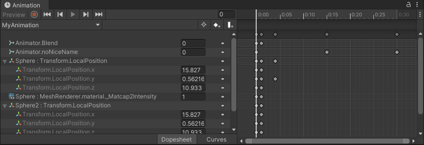
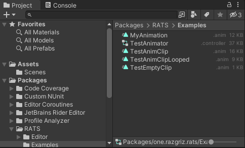
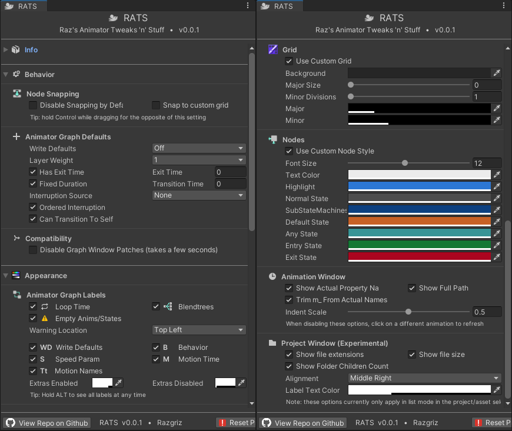

# 🐀 RATS - Raz's Animator Tweaks 'n' Stuff 🧀

  
  
  
  

## 📥 Get it from VPM! https://vpm.razgriz.one/ (Make sure to use SDK 3.4.0 or higher!)

### ⚠ RATS is changing things that the Unity editor doesn't normally allow changing! It's doing a lot, so it might break things. Hopefully not, but please [file an issue](https://github.com/rrazgriz/RATS/issues) if it does 💕

Some [Harmony](https://github.com/pardeike/Harmony)-based patches to Unity's Animator and Animation windows. It fixes some bugs, adds customization, and generally removes some of the annoyances of working with animators.

Also includes s-m-k's [Unity Animation Hierarchy Editor](https://github.com/s-m-k/Unity-Animation-Hierarchy-Editor). Originally forked from [DJ Lukis' AnimatorExtensions](https://github.com/lukis101/VRCUnityStuffs/tree/master/Scripts/Editor)

## Installation

Tested on Unity versions:
- `2019.4.31f1`
- `2021.3.22f1`

### VRChat Creator Companion

Visit https://github.com/rrazgriz/raz-vpm/blob/main/README.md and follow the instructions to add my Repository to VPM. You'll need to add the Harmony package if you don't already have Harmony in your Unity project. (Things that bundle this include [UdonSharp](https://github.com/vrchat-community/UdonSharp) and Dreadrith's [ControllerEditor](https://dreadrith.gumroad.com/l/CEditor))

### Manual

Download the latest release package from the [Releases](https://github.com/rrazgriz/RATS/releases/) page, and add to your project. You'll need Harmony, which you can get via the VRChat Base SDK 3.4.0 or higher.

If you had RATS before the VRChat Base SDK 3.4.0, you may have a Harmony package installed too - remove it when updating to 3.4.0 or higher. If you have a new enough VCC install, this should happen automatically when updating RATS.

Alternatively, you can download it from package from the source at https://github.com/pardeike/Harmony - note that you may need to use the 2.2.2 release (the .NET 4.7.2 dll) for best results.

## Features

Configure at `Tools -> RATS -> Options`. Settings are saved in [EditorPrefs](https://docs.unity3d.com/ScriptReference/EditorPrefs.html), so they persist across any projects that have RATS installed.

Compatibility: Disable certain Animator window fixes/behaviors to avoid conflicts with other tools. Not comprehensive, but should cover most common cases.

### New Options

- Customize Animator appearance! Node colors, text size, background color, grid size, and more!
- Hold Ctrl to disable state snapping (or disable snapping by default)
- Change Write Defaults setting for new states
- Change Layer Weight to 1 on new layers
- Change Transition Settings for new states
- Show extra labels on animation states
  - Animation clip/BlendTree name
  - `B` if a state has State Behaviors
  - `WD` if a state has Write Defaults enabled
  - `M` if a state has a motion time parameter
  - `S` if a state has a speed parameter
  - Icons for Blendtree/Loop Time
  - Warning icons For empty states/animations
- Hold Alt to view all labels regardless of setting
- Create Animator State by left control + double clicking
- Create Transition by Left Control + double clicking on an Animator State
- Make Multiple Transitions via State right-click menu
- Reverse/Redirect/Replicate Transitions via right-click menu
- Cleanup Controller Sub-Assets via Controller right-click menu
- Animation Window: Show actual property name instead of "Display Name" in animation hierarchy
- Animation Window: Show full path of keyframes
- Animation Window: Reduce/Disable Indentation
- Project Window: Show filesize, extension, and folder children in list mode

### Tweaks/Fixes

- Layer copy-pasting and duplication (including cross-controller) via context menu or keyboard shortcuts
- F2 keyboard shortcut to rename selected layer
- Instead of the annoying list scrollbar reset, get new or edited layer in view
- Similarly scroll to bottom when adding a new parameter
- Prevent transition condition mode/function resetting when swapping parameter
- Highlight/select animator controller by single/double-clicking its path in bottom bar
- Disable undo of "Paste Sub-Sate Machine" action as it leaves dangling sub-assets.  
  - Manually delete pasted layers or sub-state machines to correctly dispose of majority _(but still not all)_ of sub-assets!

## Known Issues

- Custom node textures disappear for a frame or two sometimes (entering/exiting playmode, script reload, scene overrides). If they disappear permanently, please let me know!
- Icons/Indicators are not super visible in Unity Light Mode
- `Unsupported.PasteToStateMachineFromPasteboard` copies some parameters, but does not copy their default values
  - It also does not have proper undo handling causing dangling sub-assets left in the controller
- State node motion label overlaps progress bar in "Live Link" mode
- Animation Window "Show Actual Names" requires selecting a different animation/object with animator to disable

## Screenshots

## Future Ideas

- Update CI to produce a proper listing of releases
- Animation: Option to rename property names
- Animation: Property name search (with "Add Property")
- Animator: Drag animation onto State to change
- Animator: Option to quickly disable loop time on states (right click?)
- Animator: Add F2-to-rename on states
- Right click: enable/disable loop time on selected animation clips
- Utility window: Retarget animation paths for selected animation clips
- Utility window: Multi-editing of states/transitions/state behaviors
- Utility window: show list of all animations categorized by folder
- Animation: Implement needle-tools-style drag-to-retarget on Animation paths
- Animator: Add undo callback handler to delete sub-state machines properly
- Animator: Clean up layer copy/paste (don't take up clipboard)

## Credits

- [DJ Lukis.LT](https://github.com/lukis101/) for the original utility script (MIT-licensed!)
- [Andreas Pardeike](https://github.com/pardeike/Harmony) for the fantastic Harmony library (MIT-licensed!)
- [Pumkin](https://github.com/rurre/) and [ScruffyRules](https://github.com/ScruffyRules) for lots of help with figuring out Harmony (and Reflection in general)
- Everyone else that helped test and give feedback!
